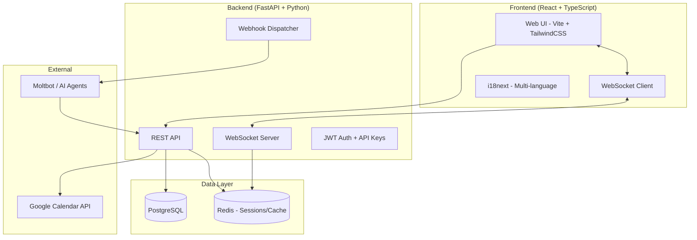
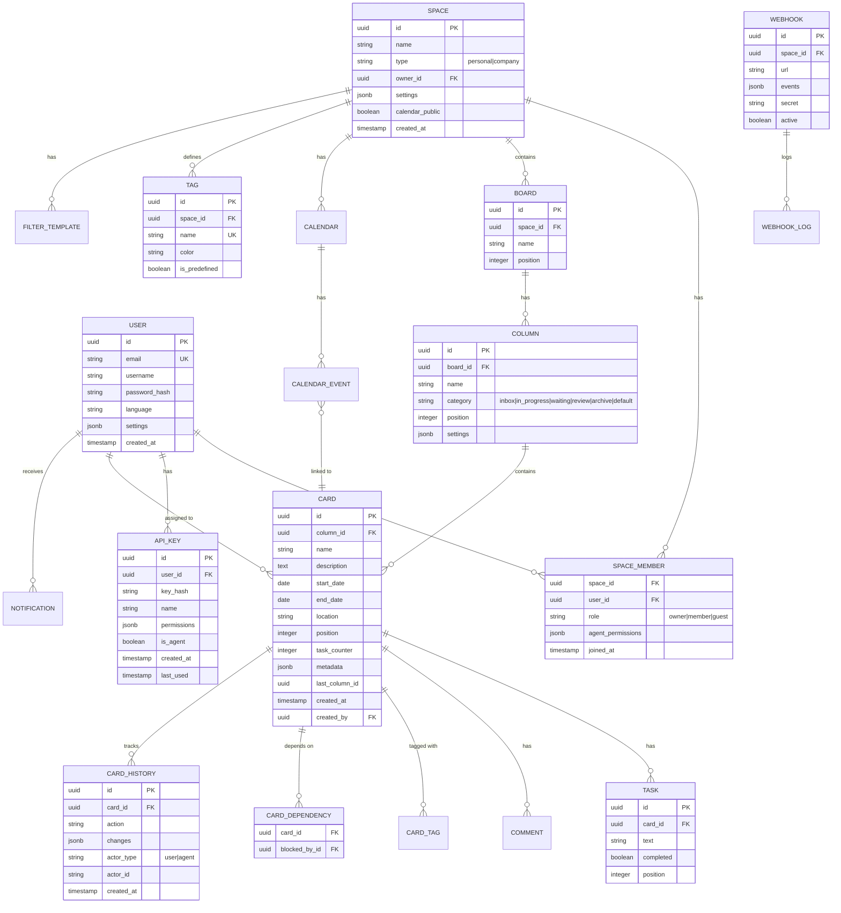

# Kanbot Implementation Plan

## Objective
Build a self-hosted, Docker-deployable kanban application designed for both human users and AI agents (Moltbot), featuring real-time collaboration, calendar integration with Google Calendar, and a complete REST API.

---

## Architecture Overview



---

## Tech Stack

| Layer | Technology | Rationale |
|-------|------------|-----------|
| Frontend | React 18 + TypeScript + Vite | Fast dev, strong typing, modern tooling |
| Styling | TailwindCSS + Framer Motion | Utility-first CSS, smooth animations |
| State | Zustand + React Query | Lightweight, great for real-time sync |
| Backend | FastAPI (Python 3.11+) | Async, auto OpenAPI docs, agent-friendly |
| Database | PostgreSQL 15 | Robust, JSON support for metadata |
| Cache/Pub-Sub | Redis | WebSocket broadcast, session store |
| Auth | JWT + API Keys | Users get JWT, agents get API keys |
| i18n | react-i18next + backend gettext | Full multi-language support |
| Container | Docker + docker-compose | Single-command deployment |

---

## Project Structure

```
kanbot/
├── docker-compose.yml
├── .env.example
├── frontend/
│   ├── src/
│   │   ├── components/
│   │   │   ├── kanban/          # Board, Column, Card components
│   │   │   ├── calendar/        # Calendar views, overlays
│   │   │   ├── spaces/          # Space list, settings
│   │   │   ├── layout/          # Sidebar, Header, Navigation
│   │   │   └── common/          # Buttons, Modals, Inputs
│   │   ├── hooks/               # Custom hooks (useWebSocket, etc.)
│   │   ├── stores/              # Zustand stores
│   │   ├── api/                 # API client functions
│   │   ├── i18n/                # Translation files
│   │   │   └── locales/         # en.json, cs.json, etc.
│   │   ├── types/               # TypeScript interfaces
│   │   └── utils/               # Helpers, constants
│   ├── Dockerfile
│   └── package.json
├── backend/
│   ├── app/
│   │   ├── api/
│   │   │   ├── v1/
│   │   │   │   ├── auth.py      # Login, register, API keys
│   │   │   │   ├── users.py     # User management
│   │   │   │   ├── spaces.py    # Space CRUD, invitations
│   │   │   │   ├── boards.py    # Kanban board operations
│   │   │   │   ├── columns.py   # Column CRUD, categories
│   │   │   │   ├── cards.py     # Card CRUD, filtering
│   │   │   │   ├── calendar.py  # Calendar events, overlays
│   │   │   │   ├── webhooks.py  # Webhook management
│   │   │   │   └── agents.py    # Agent-specific endpoints
│   │   │   └── deps.py          # Dependencies (auth, db)
│   │   ├── core/
│   │   │   ├── config.py        # Settings, env vars
│   │   │   ├── security.py      # JWT, API key validation
│   │   │   └── i18n.py          # Backend translations
│   │   ├── models/              # SQLAlchemy models
│   │   ├── schemas/             # Pydantic schemas
│   │   ├── services/            # Business logic
│   │   │   ├── google_calendar.py
│   │   │   ├── notifications.py
│   │   │   └── webhooks.py
│   │   ├── websocket/           # WebSocket handlers
│   │   └── main.py              # App entry point
│   ├── alembic/                 # DB migrations
│   ├── Dockerfile
│   └── requirements.txt
└── nginx/
    └── nginx.conf               # Reverse proxy config
```

---

## Data Model



---

## Implementation Phases

### Phase 1: Foundation
**Goal:** Running Docker environment with auth and basic data layer

- **Docker setup**
  - `docker-compose.yml` with PostgreSQL, Redis, backend, frontend, nginx
  - Environment configuration (`.env.example`)
  - Health checks and auto-restart

- **Backend foundation**
  - FastAPI app structure with versioned API (`/api/v1/`)
  - SQLAlchemy models + Alembic migrations
  - JWT authentication for users
  - API key authentication for agents (format: `{username}-bot`)
  - Core middleware (CORS, error handling, request logging)
  - i18n setup with gettext

- **Frontend foundation**
  - Vite + React + TypeScript setup
  - TailwindCSS with dark theme as default (light mode toggle)
  - Basic routing (React Router)
  - API client with axios
  - i18next setup with language detection
  - Auth pages (login, register)

### Phase 2: Core Kanban
**Goal:** Functional kanban board with real-time updates

- **Spaces system**
  - Space CRUD (personal/company types)
  - Member management (invite, remove)
  - Guest access for personal spaces
  - Space settings panel

- **Board & Columns**
  - Board creation within spaces
  - Column CRUD with drag-and-drop reordering
  - Column categories with special behaviors:
    - **Inbox**: Default landing for new cards
    - **In Progress**: Auto-sets start_date when card enters
    - **Waiting/Blocked**: "Waiting on" field (user or external)
    - **Review**: Approver assignment, approve/reject actions
    - **Archive**: Stores `last_column_id`, advanced filtering
    - **Default**: Standard column, no special behavior

- **Cards**
  - Card CRUD with all fields:
    - Name, description
    - Date range (start/end, both optional)
    - Location (free text)
    - Assigned users
    - Tasks (checklist with counter visible on card)
    - Comments
    - Tags (colors entire card background)
    - Metadata JSON (for agents)
    - Dependencies ("blocked by" cards)
  - Drag-and-drop between columns
  - Card detail modal/drawer

- **WebSocket real-time**
  - Redis pub/sub for broadcasting
  - Events: card_created, card_updated, card_moved, card_deleted
  - Presence indicators (who's viewing)

- **Filtering system**
  - Quick filters: tag, assignee, date range
  - Advanced filter modal
  - Filter template save/load per space

### Phase 3: Calendar Integration
**Goal:** Full calendar functionality with Google Calendar sync

- **Space calendars**
  - Calendar view per space (month/week/day)
  - Cards with dates auto-appear as events
  - Manual calendar events (not tied to cards)

- **Global calendar**
  - Overlay selector (pick which space calendars to show)
  - Color-coded by space/tag
  - Personal space calendar sharing toggle

- **Google Calendar integration**
  - OAuth2 flow for connecting Google account
  - Two-way sync (read + write)
  - Sync settings (which space calendars to sync)
  - Conflict handling

### Phase 4: Agent & Notification System
**Goal:** Complete agent API and notification delivery

- **Agent features**
  - Dedicated `/api/v1/agents/` endpoints with enhanced docs
  - Agent permissions per space (configurable)
  - Task delegation UI (assign task to another user's bot)
  - Full audit trail (`CARD_HISTORY` table)
  - Structured action responses for agents

- **Webhooks**
  - Webhook management per space
  - Events: card.*, column.*, space.member.*, calendar.*
  - Retry logic with exponential backoff
  - Webhook logs for debugging

- **Notifications**
  - In-app notification center
  - Push notifications (mobile via service worker)
  - Notification preferences (per-event toggles)
  - @mentions in comments trigger notifications

### Phase 5: Polish & Mobile
**Goal:** Production-ready, mobile-optimized application

- **UI/UX polish**
  - Framer Motion animations (card drag, modal transitions)
  - Keyboard shortcuts
  - Accessibility (ARIA labels, focus management)
  - Loading states and skeletons
  - Error boundaries and user-friendly error messages

- **Mobile optimization**
  - Responsive layout for all screen sizes
  - Touch-friendly drag-and-drop
  - Mobile navigation (bottom nav or hamburger)
  - PWA manifest for "Add to Home Screen"
  - Push notification permission flow

- **Additional features**
  - Global search (cards, comments, across spaces)
  - Workload view (cards per user across spaces)
  - Recurring task tool (simple cron-like interface for agents)
  - Activity feed per space
  - Data export (JSON/CSV)

---

## API Design Highlights

### Authentication
```
POST /api/v1/auth/register        # User registration
POST /api/v1/auth/login           # JWT token
POST /api/v1/auth/api-keys        # Create agent API key
DELETE /api/v1/auth/api-keys/{id} # Revoke API key
```

### Spaces
```
GET    /api/v1/spaces             # List user's spaces
POST   /api/v1/spaces             # Create space
GET    /api/v1/spaces/{id}        # Get space details
PATCH  /api/v1/spaces/{id}        # Update space
DELETE /api/v1/spaces/{id}        # Delete space
POST   /api/v1/spaces/{id}/invite # Invite member
DELETE /api/v1/spaces/{id}/members/{user_id}
```

### Cards (Agent-optimized)
```
GET    /api/v1/cards                    # List with filters
POST   /api/v1/cards                    # Create card
GET    /api/v1/cards/{id}               # Get card with all relations
PATCH  /api/v1/cards/{id}               # Update card
DELETE /api/v1/cards/{id}               # Delete card
POST   /api/v1/cards/{id}/move          # Move to column
POST   /api/v1/cards/{id}/tasks         # Add task
PATCH  /api/v1/cards/{id}/tasks/{tid}   # Toggle/update task
POST   /api/v1/cards/{id}/comments      # Add comment
GET    /api/v1/cards/{id}/history       # Audit trail
```

### Agent-specific
```
GET    /api/v1/agents/me                # Current agent info
GET    /api/v1/agents/actions           # Available actions reference
POST   /api/v1/agents/delegate          # Delegate task to another user's bot
GET    /api/v1/agents/audit             # Query audit logs
```

### Webhooks
```
GET    /api/v1/webhooks                 # List webhooks
POST   /api/v1/webhooks                 # Create webhook
DELETE /api/v1/webhooks/{id}            # Delete webhook
GET    /api/v1/webhooks/{id}/logs       # Recent delivery logs
```

---

## Column Category Behaviors

| Category | Auto-behaviors | Special Features |
|----------|---------------|------------------|
| **Inbox** | New cards land here by default | Quick-add shortcut |
| **In Progress** | Sets `start_date` = today on entry | Shows "days active" badge |
| **Waiting** | None | Required "waiting_on" field |
| **Review** | None | Approve/Reject buttons, approver field |
| **Archive** | Stores `last_column_id` | Restore button, advanced date/tag/column filters |
| **Default** | None | Standard kanban column |

---

## Verification & Definition of Done

| Phase | Targets | Verification |
|-------|---------|--------------|
| **Phase 1** | Docker env, auth, i18n skeleton | `docker-compose up` starts all services; login/register works; API docs at `/docs` |
| **Phase 2** | Kanban CRUD, WebSocket, filtering | Create space → board → columns → cards; drag-drop updates in real-time across tabs; filters work |
| **Phase 3** | Calendars, Google sync | Cards with dates show on calendar; Google Calendar events sync both ways |
| **Phase 4** | Agent API, webhooks, notifications | Agent can perform all card operations via API key; webhooks fire on events; push notifications arrive |
| **Phase 5** | Mobile, animations, search | Full functionality on mobile; smooth animations; search finds cards across spaces |

### End-to-End Acceptance Tests
1. **User flow**: Register → Create company space → Invite member → Create board → Add cards → Drag to archive → Filter archived by date
2. **Agent flow**: Create API key → Use key to create card → Move card → Add comment → Verify audit log shows `{user}-bot`
3. **Calendar flow**: Create card with dates → View on calendar → Connect Google Calendar → Verify event appears in Google
4. **Mobile flow**: Open on phone → Navigate spaces → Drag card → Receive push notification
5. **Multi-language**: Switch language in settings → All UI updates → Create card → Card content stays in original language

---

## Key Constraints & Dependencies

- **Google Calendar API** requires Google Cloud project with Calendar API enabled
- **Push notifications** require HTTPS in production (or localhost for dev)
- **WebSocket** connections need sticky sessions if load-balanced (handled by single-instance for self-hosted)
- **i18n** translations need to be maintained for each supported language

---

## File Deliverables Summary

| Component | Key Files |
|-----------|-----------|
| Docker | `docker-compose.yml`, `Dockerfile` (frontend/backend), `nginx.conf` |
| Backend API | `app/api/v1/*.py` (12+ route files) |
| Backend Models | `app/models/*.py` (User, Space, Board, Column, Card, etc.) |
| Backend Services | `app/services/google_calendar.py`, `notifications.py`, `webhooks.py` |
| Frontend Components | `src/components/kanban/`, `calendar/`, `spaces/`, `layout/` |
| Frontend Stores | `src/stores/` (auth, spaces, boards, cards, calendar, notifications) |
| Translations | `frontend/src/i18n/locales/en.json`, `cs.json`, etc. |
